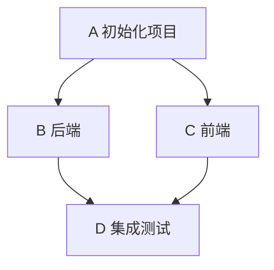
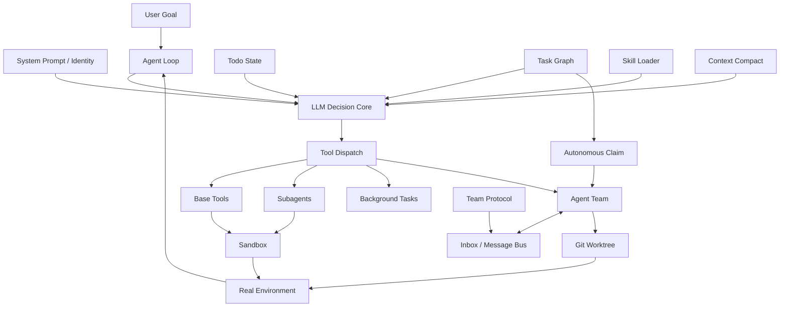

# QianAgent

> **从零实现 Coding Agent：从 Agent Loop 到完整 Agent Runtime**
>
> 一份可以反复复习、继续二次开发的 Agent Runtime 架构笔记。
> 本文档是 QianAgent 的设计依据与系统全景；下方「在 QianAgent 代码库中的对应实现」一节把每个概念映射到了具体模块。

QianAgent 是一个从经典 **LLM tool-loop** 一步步长出来的轻量 Coding Agent（Python 3.11+）。它把整个系列里讲到的能力——Agent Loop、工具系统、Todo、子智能体、技能加载、上下文压缩、任务图、后台任务、多智能体、协议、自主调度和 Worktree 隔离——最终合成一个完整的 Coding Agent Runtime。

> 目标不是复制 Claude Code，而是把「模型的 agency」和「运行时 harness」拆开：**模型负责决定下一步，QianAgent 负责提供安全、可恢复、可观测的执行环境。**

---

## 目录

- [0. 一句话先讲清楚](#0-一句话先讲清楚)
- [1. 全部能力总览](#1-全部能力总览)
- [2. S01：Agent Loop —— 一切的核心](#2-s01agent-loop--一切的核心)
- [3. S02：Tool Use —— 从一个 Bash 到工具系统](#3-s02tool-use--从一个-bash-到工具系统)
- [4. S03：TodoWrite —— 把计划变成显式状态](#4-s03todowrite--把计划变成显式状态)
- [5. S04：Subagent —— 上下文隔离](#5-s04subagent--上下文隔离)
- [6. S05：Skill Loading —— 按需加载知识](#6-s05skill-loading--按需加载知识)
- [7. S06：Context Compact —— 管理有限上下文](#7-s06context-compact--管理有限上下文)
- [8. S07：Task System —— 从 Todo List 到任务图](#8-s07task-system--从-todo-list-到任务图)
- [9. S08：Background Tasks —— 非阻塞执行](#9-s08background-tasks--非阻塞执行)
- [10. S09：Agent Teams —— 持久多智能体](#10-s09agent-teams--持久多智能体)
- [11. S10：Team Protocols —— 从「能通信」到「可靠协调」](#11-s10team-protocols--从能通信到可靠协调)
- [12. S11：Autonomous Agents —— 自己找活干](#12-s11autonomous-agents--自己找活干)
- [13. S12：Worktree + Task Isolation —— 多 Agent 环境隔离](#13-s12worktree--task-isolation--多-agent-环境隔离)
- [14. 最终章：12 话如何合成一个 QianAgent Runtime](#14-最终章12-话如何合成一个-qianagent-runtime)
- [15. 真正应该掌握的几个关键区别](#15-真正应该掌握的几个关键区别)
- [16. 一个完整任务如何流过整个 Runtime](#16-一个完整任务如何流过整个-runtime)
- [17. 最小化后的整体伪代码](#17-最小化后的整体伪代码)
- [18. 整个系列真正的系统级抽象](#18-整个系列真正的系统级抽象)
- [19. 为什么 Tool Dispatch 是整个系统的「关节」](#19-为什么-tool-dispatch-是整个系统的关节)
- [20. 一条最重要的工程原则](#20-一条最重要的工程原则)
- [21. 最终记忆版](#21-最终记忆版)
- [22. 在 QianAgent 代码库中的对应实现](#22-在-qianagent-代码库中的对应实现)
- [23. 快速开始](#23-快速开始)
- [24. License](#24-license)

---

## 0. 一句话先讲清楚

整个系列真正想表达的不是：

> 「Claude Code 是一个很神奇的 Prompt。」

而是：

> **以 LLM 作为决策核心，以 Agent Loop 作为控制循环，再逐步加入工具、任务状态、子智能体、技能加载、上下文压缩、任务图、后台任务、多智能体、协议、自主调度和 Worktree 隔离，最后形成一个完整的 Coding Agent Runtime。**

最底层始终没有变：

```text
User / Environment
        ↓
      Messages
        ↓
        LLM
        ↓
   Tool Call / Final
        ↓
      Runtime
        ↓
 Tool Result / State
        ↓
      Messages
        ↓
        LLM
```

---

## 1. 全部能力总览

| 章节 | 核心能力 | 解决的问题 | 代码级关键词 |
|---|---|---|---|
| S01 | Agent Loop | 模型怎么连续行动 | `while True` |
| S02 | Tool Use | 模型怎么调用多个真实工具 | `TOOL_HANDLERS[tool_name]` |
| S03 | TodoWrite | 长任务怎么保持计划、不跑偏 | `TodoManager.update()` |
| S04 | Subagent | 高噪声探索怎么不污染主上下文 | `sub_messages` |
| S05 | Skill Loading | 专业知识太多，怎么按需加载 | `SkillLoader.get_content()` |
| S06 | Context Compact | 上下文越来越长怎么办 | `compact(messages)` |
| S07 | Task System | 复杂任务依赖、顺序、并行怎么表达 | `blocked_by` |
| S08 | Background Tasks | 长耗时命令怎么不阻塞主循环 | `BackgroundManager` |
| S09 | Agent Teams | 怎么建立长期存在的多智能体团队 | `inbox / message bus` |
| S10 | Team Protocols | 多 Agent 怎么可靠协调 | `request / response` |
| S11 | Autonomous Agents | Agent 怎么自己找活干 | `claim_task` |
| S12 | Worktree + Task Isolation | 多 Agent 并行改代码怎么互不污染 | `worktree / cwd` |

---

## 2. S01：Agent Loop —— 一切的核心

### 2.1 普通 LLM 为什么还不是 Agent

普通 LLM 的模式是：

```text
输入
↓
LLM
↓
输出
```

它可以告诉你怎么修改代码，但它本身不会自动完成：

```text
读文件
→ 修改文件
→ 运行测试
→ 看报错
→ 再修改
→ 再测试
```

如果这些步骤都由人来完成，那么真正负责循环的是人：

```text
Human
→ LLM
→ Human 执行
→ Human 把结果复制回来
→ LLM
```

Agent Loop 做的事情，就是把这层「人肉循环」程序化。

### 2.2 最小 Agent Loop

```python
messages = [
    {"role": "user", "content": user_prompt}
]

while True:
    response = llm(messages, tools=tools)

    messages.append(response)

    if response.stop_reason != "tool_use":
        return response

    results = []

    for tool_call in response.tool_calls:
        output = execute_tool(tool_call)
        results.append(output)

    messages.append(results)
```

核心循环：

```text
LLM
↓
Tool Call
↓
Execute
↓
Tool Result
↓
LLM
```

这就是最小智能体。

### 2.3 `messages` 是什么

可以把 `messages` 理解为：

> **Agent 当前工作的短期上下文。**

里面会不断积累：

```text
用户任务
模型回答
工具调用
工具结果
后续判断
```

因此 S01 同时埋下了后面 S06 的问题：

> `messages` 会越来越大。

### 2.4 Function Calling 的本质

模型并不是「真的执行函数」，而是输出一个结构化动作意图。

例如不是输出：

```text
我建议运行 ls。
```

而是：

```json
{
  "name": "bash",
  "input": {
    "command": "ls"
  }
}
```

真正执行的是 Runtime 中的 Python 代码。

因此：

```text
LLM = 决策
Runtime = 执行
```

---

## 3. S02：Tool Use —— 从一个 Bash 到工具系统

S01 只有一个 Bash 工具时，理论上已经很强：

```bash
cat main.py
pytest
git status
mkdir test
```

但工程上问题很多：

- 长文本输出可能截断；
- shell 字符串容易受特殊字符影响；
- 所有动作都走 Bash，稳定性差；
- 安全边界很难控制；
- 每多一种能力就容易写很多 `if/elif`。

因此 S02 引入专用工具：

```text
bash
read_file
write_file
edit_file
```

### 3.1 Tool Schema 与 Handler

一个完整 Tool 分两层。

**Tool Schema：给模型看**

```python
{
    "name": "read_file",
    "description": "Read a file",
    "input_schema": {
        "type": "object",
        "properties": {
            "path": {"type": "string"}
        },
        "required": ["path"]
    }
}
```

它告诉模型：

```text
我有一个 read_file(path) 能力。
```

**Handler：真正执行**

```python
def run_read(path):
    ...
```

也就是：

```text
Schema
→ LLM 生成 Tool Call
→ Runtime 找 Handler
→ Handler 真正操作环境
```

### 3.2 Dispatch Map

不再写：

```python
if name == "bash":
    ...
elif name == "read_file":
    ...
elif name == "write_file":
    ...
```

而是：

```python
TOOL_HANDLERS = {
    "bash": run_bash,
    "read_file": run_read,
    "write_file": run_write,
    "edit_file": run_edit,
}
```

执行时：

```python
handler = TOOL_HANDLERS.get(tool_call.name)
output = handler(**tool_call.input)
```

因此：

> **新增工具，不需要改 Agent Loop，只需要新增 Schema + Handler。**

### 3.3 Sandbox / `safe_path`

S02 还加入路径安全。

如果 Agent 工作目录是：

```text
/home/user/project
```

模型传入：

```text
../../etc/passwd
```

Runtime 必须拒绝。

所以：

```text
Prompt 负责告诉模型「应该怎么做」
Runtime 负责决定「到底允不允许做」
```

这是一条非常重要的 Agent 工程原则。

---

## 4. S03：TodoWrite —— 把计划变成显式状态

没有计划的 Agent 很容易：

```text
重复做事
跳步
跑偏
忘记原目标
```

尤其当对话越来越长、工具结果越来越多时，原始计划会逐渐被上下文噪声稀释。

因此 S03 引入 `TodoManager`。

### 4.1 Todo 不只是 UI

TodoWrite 的真正意义不是「展示一个清单」，而是：

> **把原本只存在于模型脑内的计划，变成 Runtime 中可见、可更新、可反馈的显式状态。**

例如：

```python
[
    {"content": "创建包目录", "status": "completed"},
    {"content": "实现核心代码", "status": "in_progress"},
    {"content": "补测试", "status": "pending"},
]
```

状态主要包括：

```text
pending
in_progress
completed
```

### 4.2 Todo 也是 Tool

S03 把 Todo 加进工具系统：

```python
TOOL_HANDLERS = {
    "bash": run_bash,
    "read_file": run_read,
    "write_file": run_write,
    "edit_file": run_edit,
    "todo": todo_manager.update,
}
```

这延续了 S02 的设计：

```text
新能力 = Schema + Handler
```

### 4.3 Reminder

光有 Todo Tool 不代表模型一定记得调用。

因此课程实现了 `rounds_since_todo`：如果连续多轮没有更新 Todo，就向上下文插入 Reminder，把模型拉回任务计划。

因此 S03 实际是：

```text
System Prompt + Todo Tool + Todo State + Reminder
```

组成一个弱约束规划器。

---

## 5. S04：Subagent —— 上下文隔离

S03 能防止 Agent 跑偏，但主 Agent 的 `messages` 还是会被大量探索过程污染。

例如为了确认项目测试框架，主 Agent 可能要：

```text
读 pyproject.toml
读 requirements.txt
读 README
grep pytest
跑测试
看报错
继续搜索
```

如果全部进入主 `messages`：

```text
主上下文 = 大量中间过程 + 少量真正结论
```

因此 S04 引入 Subagent。

### 5.1 Subagent 的核心不是「多一个模型」

真正核心是：

> **独立的 `sub_messages`。**

```python
sub_messages = [
    {"role": "user", "content": subtask_prompt}
]
```

子 Agent 在自己的上下文里：

```text
读文件
跑命令
失败
重试
继续探索
```

最终只把一段 summary 返回父 Agent。

### 5.2 Agent 作为 Tool

父 Agent 多了 `task` 工具。它的 Handler 不是普通函数，而是 `run_subagent(prompt)`：

```text
task → run_subagent → 另一个 Agent Loop
```

因此从这里开始：

> **Agent 本身也可以被抽象成 Tool。**

### 5.3 Subagent 与 Todo 的区别

```text
Todo = 计划管理
Subagent = 任务委派 + 上下文隔离
```

Todo 回答「我要做哪些事情？」；Subagent 回答「这件局部的事情，要不要交给一个独立 Agent 去做？」

### 5.4 Subagent 与 Agent Team 的区别

Subagent：

```text
临时
短生命周期
完成即销毁
没有跨调用身份
```

Agent Team Member：

```text
长期存在
有身份
有自己的历史
持续协作
```

---

## 6. S05：Skill Loading —— 按需加载知识

随着 Agent 能力增多，会出现另一个问题：

> 如果每种工作流都写进 System Prompt，上下文会非常浪费。

例如 Git Skill、Testing Skill、Code Review Skill、PDF Skill、Agent Builder Skill……如果每个 Skill 都几千 token，一次性全部注入非常低效。

### 6.1 Tool 与 Skill 的区别

```text
Tool = Agent 能做什么动作
Skill = Agent 应该怎样完成某类工作
```

可以简单记：

```text
Tool = 手
Skill = 方法论 / 专业知识
```

### 6.2 Progressive Loading

一开始只告诉模型 Skill 名称 + 简短 Description：

```text
code-review: Review code for correctness and maintainability.
pdf: Read and process PDF documents.
```

真正需要时 `load_skill("code-review")`，再把完整 `SKILL.md` 加载进上下文。

```text
Skill Catalog → 模型判断需要什么 → load_skill → 完整 Skill
```

### 6.3 SkillLoader

课程中的核心抽象：

```python
class SkillLoader:
    ...
```

主要负责：扫描 Skill → 读取 name / description → 按需 `get_content`。Skill 目录还可以包含 `SKILL.md`、`references/`、`scripts/` 等。因此 Skill 更像：

> **一个按需加载的小型知识 / 工作流包。**

---

## 7. S06：Context Compact —— 管理有限上下文

Agent Loop 天生会导致 `messages` 只增不减。大型项目里读几十个文件、跑大量命令、加入 Skill、加入 Subagent Summary、加入 Todo / Task 状态，最终都会占满上下文。所以 S06 引入 Context Compact。

### 7.1 第一层：Micro Compact

把大型 Tool Result 从主上下文卸载出去：

```text
原来：[一万字 pytest 输出]
压缩后：[Tool output stored as artifact / transcript X]
```

真正的大块内容放到磁盘 / transcript / storage，主上下文只留下引用。这更像 **Offloading** 而不是摘要。

### 7.2 第二层：Auto Compact

当历史对话本身已经太长：

```text
调用 LLM → 对旧对话做摘要 → 保存 transcript → 用摘要替换部分旧历史
```

例如把「过去 30 轮完整历史」压缩成：

```text
Current State:
- 当前目标
- 已完成修改
- 当前失败测试
- 重要约束
```

### 7.3 Compact Tool

课程还加入了 Compact Tool，让 Agent / Runtime 可以主动触发压缩。整体思想是：

```text
完整原文 → 引用 / 卸载 → 摘要 → 更紧凑的持续上下文
```

核心目标：**给未来真正重要的新信息腾空间。**

---

## 8. S07：Task System —— 从 Todo List 到任务图

S03 的 Todo 是扁平清单：

```text
[ ] 搭项目
[ ] 写后端
[ ] 写前端
[ ] 测试
```

但它很难表达：

```text
谁依赖谁
哪些可以并行
哪些必须等待
```

因此 S07 引入带依赖的 Task System。

### 8.1 Task Graph

例如：

```text
Task A：初始化项目
Task B：实现后端   blocked_by: A
Task C：实现前端   blocked_by: A
Task D：集成测试   blocked_by: B, C
```



这已经不是 List，而是 **DAG / Task Graph**。

### 8.2 Todo 与 Task System

```text
Todo = 当前 Agent 的短期执行清单
Task System = 整个项目的结构化任务图
```

可以记成：

```text
Todo = 个人便签
Task System = 项目管理系统
```

### 8.3 持久化

课程把 Task 持久化到磁盘（例如 JSON）。任务可以包含 `id / status / owner / blocked_by` 等。于是 Agent 重启后仍然可以恢复任务状态。

---

## 9. S08：Background Tasks —— 非阻塞执行

有些命令很慢：

```text
pip install
npm install
docker build
pytest
环境构建
```

如果 `subprocess.run(...)` 同步等待，整个 Agent Loop 会被阻塞。因此 S08 引入后台任务。

### 9.1 BackgroundManager

```text
启动任务 → 交给后台线程 / 子进程 → 主 Agent 继续工作
→ 后台任务完成 → 结果进入 Queue → 后续轮次重新注入 Agent
```

### 9.2 Background Task 与 Subagent

这两个很容易混淆。

**Background Task**：没有 LLM，不会思考，只是异步执行命令（例如 `docker build`、`pytest`）。

**Subagent**：有 LLM，有自己的 Agent Loop，会自主探索（例如「调查为什么测试失败」）。

可以记：

```text
Background Task = 异步 Worker
Subagent = 临时智能 Worker
```

---

## 10. S09：Agent Teams —— 持久多智能体

Subagent 完成任务就销毁。真正的团队需要：

```text
长期身份
生命周期
独立上下文
通信通道
```

因此 S09 引入 Agent Teams。

### 10.1 Teammate

例如 `Lead / Alice / Bob`，每个 Agent 都拥有自己的 `Agent Loop / messages / 身份 / 状态`。它们不是一次性函数。

### 10.2 Team Roster

课程通过配置保存有哪些 Agent、角色是什么、当前状态是什么：

```text
.tm/
├── config.json
└── inbox/
```

### 10.3 Inbox / Message Bus

Agent 之间通过 JSONL Inbox 通信：

```json
{
  "from": "alice",
  "to": "bob",
  "content": "API completed. Please test."
}
```

每个 Agent 在下一次调用 LLM 前：检查 Inbox → 读取新消息 → 注入自己的上下文。

因此 S09 的核心是：

```text
Persistent Agent + Mailbox + Independent Agent Loop
```

---

## 11. S10：Team Protocols —— 从「能通信」到「可靠协调」

S09 解决「Agent 怎么说话」，但「能说话」不等于「可靠协作」。例如 `Lead` 直接杀掉 `Bob`，如果 Bob 正在写文件，就可能留下半成品和错误状态。因此 S10 引入 `Request / Response Protocol`。

### 11.1 结构化握手

例如 Shutdown：

```text
Lead → shutdown_request
Bob  → approve / reject
如果 approve → cleanup → shutdown
```

而不是 `kill`。

### 11.2 `request_id`

每个请求需要一个唯一 ID：

```json
{
  "type": "shutdown_request",
  "request_id": "req_123"
}
```

响应时带上同一个 `request_id`：

```json
{
  "type": "shutdown_response",
  "request_id": "req_123",
  "approved": true
}
```

这样系统知道「这个 Response 对应哪个 Request」。

### 11.3 Protocol 也可以用于计划审批

例如高影响修改：

```text
Agent 提交 Plan → Lead Review → Approve / Reject
```

所以：

```text
S09 = Communication
S10 = Coordination Protocol
```

---

## 12. S11：Autonomous Agents —— 自己找活干

S09 的 Agent Team 虽然是长期成员，但仍然可能依赖 Lead 手动派活。S11 的目标是：

> **空闲 Agent 自己去任务看板找可执行任务。**

### 12.1 Work / Idle

Agent 生命周期被分成 `WORK` 和 `IDLE`。当前任务结束进入 Idle 后不是什么都不做，而是：

```text
检查 Inbox + 扫描 Task Board
```

### 12.2 Claim Task

如果发现：

```text
status = pending
owner = null
blocked_by = []
```

则可以：

```text
claim task → owner = self → WORK
```

所以调度模式从 `Lead Push Task` 开始变成 `Agent Pull Task`。

### 12.3 Identity Reinjection

因为 S06 会压缩上下文，Agent 可能逐渐忘记「我是谁、我的角色是什么、属于哪个 Team」。所以 S11 额外强调：

> **每次继续工作时重新注入 Identity。**

这说明：**身份应该是 Runtime State，而不能只依赖聊天历史。**

---

## 13. S12：Worktree + Task Isolation —— 多 Agent 环境隔离

到 S11 后，多个 Agent 已经真的可以并行工作。此时出现一个严重问题：

```text
所有 Agent 共享同一个工作目录
```

如果 Alice 和 Bob 同时修改 `config.py`，就会互相覆盖、污染，甚至无法干净回滚。所以 S12 引入 Git Worktree。

### 13.1 Task 与 Worktree 绑定

核心关系：

```text
Task ID ↔ Git Worktree ↔ 独立 CWD
```

例如：

```text
Task A → .worktrees/task-a
Task B → .worktrees/task-b
```

Alice：`cwd = .worktrees/task-a`；Bob：`cwd = .worktrees/task-b`。因此即使都修改 `config.py`，也不会互相覆盖。

### 13.2 Sandbox 与 Worktree 的区别

**Sandbox** 解决 `Agent ↔ 操作系统`，主要是安全边界（Agent 不能跑出允许目录）。

**Worktree Isolation** 解决 `Agent A ↔ Agent B`，主要是协作隔离（多个 Agent 不要污染彼此的代码状态）。

可以记：

```text
Sandbox = Security Boundary
Worktree = Collaboration Boundary
```

---

## 14. 最终章：12 话如何合成一个 QianAgent Runtime

最终章把前面的能力重新合成一个系统。核心仍然是 `Agent Loop`，其他能力都围绕它扩展。



---

## 15. 真正应该掌握的几个关键区别

### 15.1 Tool vs Skill

```text
Tool = 能做什么
Skill = 应该怎么做
```

### 15.2 Todo vs Task System

```text
Todo = 当前 Agent 的扁平计划
Task System = 带依赖、可持久化的任务图
```

### 15.3 Background Task vs Subagent

```text
Background Task = 不会思考的异步任务
Subagent = 有 LLM、有 Loop 的临时智能体
```

### 15.4 Subagent vs Agent Team

```text
Subagent = 一次性，完成即销毁，主要用于上下文隔离
Teammate = 长期存在，有身份，有 Inbox，持续协作
```

### 15.5 Sandbox vs Worktree

```text
Sandbox = Agent 与系统之间的安全隔离
Worktree = Agent 与 Agent 之间的工作环境隔离
```

### 15.6 Messages vs Todo State vs Task State

```text
Messages = 我经历过什么
Todo = 我当前准备怎么做
Task Graph = 整个系统有哪些工作，以及它们之间的依赖
```

---

## 16. 一个完整任务如何流过整个 Runtime

用户：「重构这个大型仓库，提升后端性能，补测试，不要破坏现有功能。」系统可能这样工作。

1. **Agent Loop 启动**：`User → Messages → LLM`
2. **TodoWrite 建立短期计划**：分析 → 重构 → 测试 → 验证
3. **Task System 建立任务图**：A 调查后端 / B 调查测试 / C 重构数据库 / D 重构 API / E 补测试 / F 集成验证
4. **Agent Team / Autonomous Claim**：Alice、Bob 进入 Idle 后扫描任务图，Ready Task → Claim → Work
5. **Worktree 隔离**：Alice → `worktree/task-c`，Bob → `worktree/task-e`
6. **Skill Loading**：Alice 做数据库优化 `load_skill(database-performance)`；Bob 写测试 `load_skill(test)`
7. **Subagent 做高噪声探索**：`task("调查为什么这个模块测试失败")`，内部跑很多轮，只返回 summary
8. **Background Task 跑慢命令**：`pytest / benchmark / docker build` 放到后台，不阻塞主 Agent
9. **Agent Team 互相通信**：Bob 发现问题 `send → Alice`
10. **Protocol 控制高风险协调**：`plan_request → approve / reject`
11. **Context Compact**：旧 Tool Result → 卸载；旧历史 → 摘要
12. **完成、Review、Merge**：不同 Worktree → review → merge → task completed

---

## 17. 最小化后的整体伪代码

真正的实现会复杂得多，但从架构上可以压成：

```python
def agent_loop(query, runtime):
    messages = [user_message(query)]

    while True:
        runtime.reinject_identity(messages)
        runtime.check_inbox(messages)
        runtime.poll_background_results(messages)
        runtime.maybe_compact(messages)

        response = llm(
            messages=messages,
            tools=runtime.available_tools(),
        )

        messages.append(response)

        if response.stop_reason != "tool_use":
            if runtime.should_idle():
                task = runtime.claim_ready_task()

                if task:
                    messages.append(user_message(task.prompt))
                    continue

            return response

        for call in response.tool_calls:
            handler = runtime.tool_handlers[call.name]

            result = handler(**call.input)

            messages.append(
                tool_result(call.id, result)
            )
```

外围 Runtime 继续维护：

```text
Tool Handlers / Todo State / Task Graph / Skill Loader / Context Store
Subagents / Background Manager / Team Manager / Inbox / Protocols / Worktrees
```

---

## 18. 整个系列真正的系统级抽象

可以把整个 Agent Runtime 类比为一个「小型操作系统 / Actor Runtime」：

```text
LLM         ≈ 决策器
Agent Loop  ≈ 主控制循环
Tools       ≈ 系统调用
Tool Dispatch ≈ 调用路由
Sandbox     ≈ 权限边界
Todo        ≈ 当前工作状态
Task Graph  ≈ 作业依赖图 / 调度图
Skill       ≈ 动态知识模块
Context     ≈ 工作内存
Compact     ≈ 内存压缩 / 卸载
Subagent    ≈ 临时智能 Worker
Background Task ≈ 异步 Job / 子进程
Agent Team  ≈ 持久 Actor / Worker
Inbox       ≈ Mailbox / IPC
Team Protocol ≈ 协调协议
Autonomous Claim ≈ Worker 自主领取任务
Worktree    ≈ 独立执行环境
```

---

## 19. 为什么 Tool Dispatch 是整个系统的「关节」

最终很多不同能力都可以统一成：

```text
LLM → 结构化意图 → tool_name → dispatcher → handler
```

例如：

```text
read_file      → run_read()
load_skill     → skill_loader.get_content()
task           → run_subagent()
task_create    → task_manager.create()
send_message   → message_bus.send()
compact        → compact_context()
```

因此虽然这些能力分别属于文件、知识、Agent、任务、消息、上下文，但对 Agent Loop 来说都能统一成 **Tool Call**。这就是工具抽象的力量。

---

## 20. 一条最重要的工程原则

整个系列学完以后，应该形成这个认知：

> **LLM 负责提出意图，Runtime 负责验证、调度、执行和保存状态。**

例如：

```text
LLM：我要读取 ../../etc/passwd
Runtime：Sandbox 拒绝

LLM：我要做 Task 4
Runtime：检查 blocked_by / owner / status

LLM：我要关闭 Bob
Runtime：Team Protocol 发起 request / response

LLM：我要修改仓库
Runtime：绑定对应 Worktree / CWD
```

所以真正可靠的 Agent：

```text
不是让模型拥有无限权限
```

而是：

```text
让模型表达意图 + 让 Runtime 对意图做工程化控制
```

---

## 21. 最终记忆版

如果以后忘了 12 话，只记下面这套。

```text
S01 Loop        持续行动
S02 Tool        触达环境
S03 Todo        保持计划
S04 Subagent    隔离局部探索
S05 Skill       按需加载知识
S06 Compact     管理上下文
S07 Task        表达任务依赖
S08 Background  避免长任务阻塞
S09 Team        长期多 Agent
S10 Protocol    可靠协调
S11 Autonomous  自己找活
S12 Worktree    环境隔离
```

进一步压缩：

```text
Loop → Action → Planning → Delegation → Knowledge
→ Memory → Scheduling → Concurrency → Team
→ Protocol → Autonomy → Isolation
```

再压缩成最底层：**LLM 决策 + Runtime 控制的循环。**

---

## 22. 在 QianAgent 代码库中的对应实现

QianAgent 把上面这套概念落到了具体的 Python 模块（`qian/`）和分步教学目录（`steps/01_*` … `27_*`）里。映射如下：

| 报告概念 | QianAgent 模块 | 对应 Step |
|---|---|---|
| Agent Loop | `qian/agent.py` | 01 |
| 文件工具 / Tool Dispatch | `qian/tools.py` | 02 |
| 权限 / Sandbox | `qian/permissions.py` | 06 |
| 流式 Session | `qian/session.py` | 04 / 05 |
| Subagent | `qian/subagent.py` | 13 |
| Skill Loading | `qian/skills.py` | 11 |
| Context Compact（snip/auto/reactive） | `qian/context.py` | 06 / 08 / 09 |
| Memory（recall/extract/consolidate） | `qian/memory.py` | 10 |
| MCP | `qian/mcp_client.py` | 14 |
| Todo（session scratchpad） | `qian/todo.py` | 03 → 20 |
| Task DAG（持久、claim/unblock） | `qian/tasks.py` | 20 |
| Background Tasks | `qian/background.py` | 21 |
| Cron Scheduler | `qian/scheduler.py` | 22 |
| Agent Teams + Protocol | `qian/teams.py` | 23 |
| Workflow Runtime | `qian/workflows.py` | 24 |
| Goal Loop | `qian/goals.py` | 25 |
| Worktree Isolation | `qian/worktrees.py` | 26 |
| Hooks / Trace | `qian/hooks.py` | 19 |
| Runtime Harness（组合根） | `qian/harness.py` | 27 |

> 设计边界：所有协调器能力最终都回到同一个 tool-loop；不引入 LangGraph，也不建立第二套隐藏 Agent 框架。详见 [`docs/runtime-architecture.md`](docs/runtime-architecture.md)。

---

## 23. 快速开始

```bash
git clone https://github.com/xiaoqianran/QianAgent.git
cd QianAgent
pip install -e .
cp .env.example .env
```

OpenAI-compatible：

```bash
OPENAI_API_KEY=sk-...
OPENAI_BASE_URL=https://your-gateway/v1
QIAN_MODEL=gpt-4o
```

Anthropic：

```bash
ANTHROPIC_API_KEY=sk-ant-...
QIAN_MODEL=claude-sonnet-4-6
```

运行：

```bash
python -m qian "检查这个项目并修复测试"
python -m qian --yolo "实现需求并运行测试"
python -m qian --plan "只分析并输出计划"
python -m qian --dont-ask "CI 环境下执行安全任务"
python -m qian --resume
```

REPL 内置命令：`/clear /turns /cost /context /compact /memory /skills /plan /todo /tasks /background /crons /team /workflows /goal /worktrees /trace /<skill> exit`。

自测：

```bash
python -m compileall -q qian steps tests
PYTHONPATH=. python -m unittest -v tests.test_runtime_extensions
```

运行时产生的数据（`.qian/tasks/`、`.qian/team/`、`.qian/runtime/`、`.qian/worktrees/`、`.qian/traces/`、`.qian/scheduled_tasks.json`）默认不入 Git；Skills 与 Workflows 可以作为项目配置入库。

---

## 24. License

MIT。
