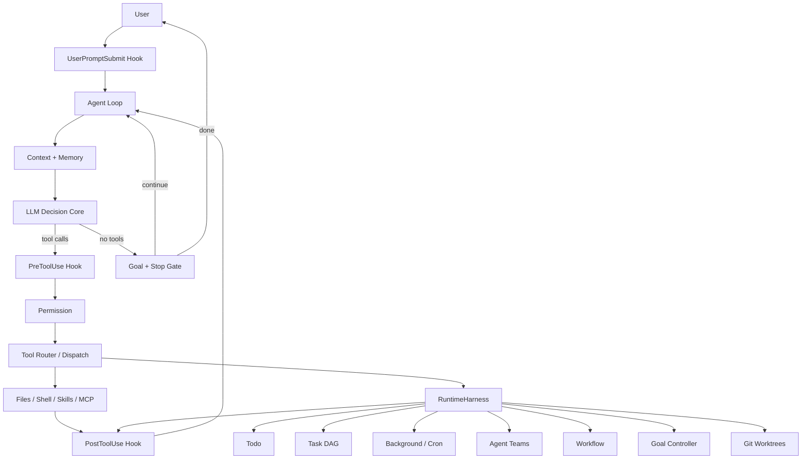
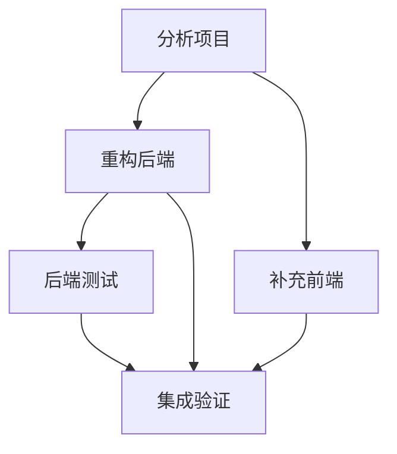
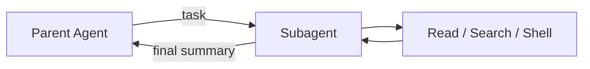
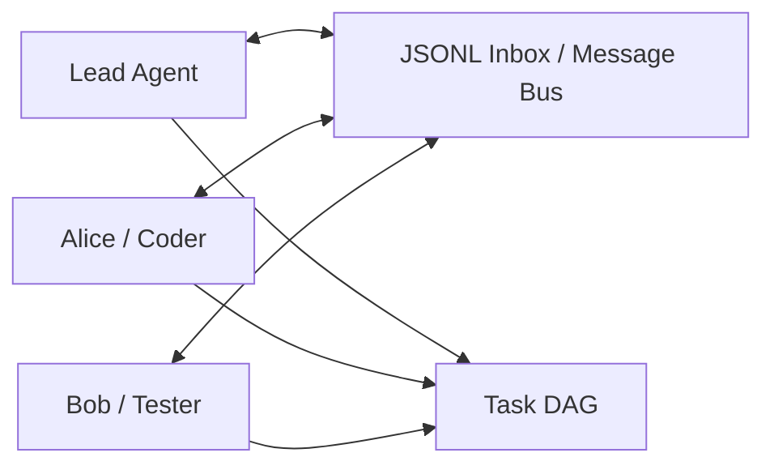
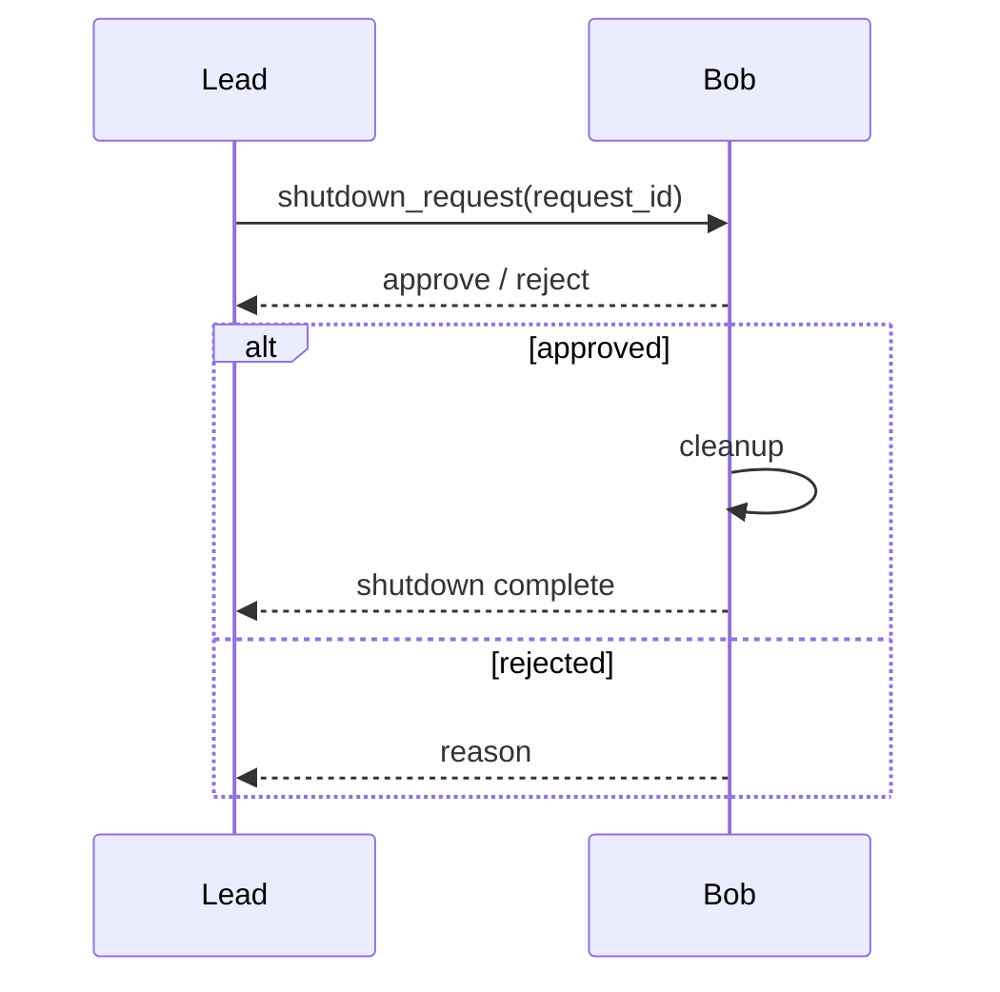
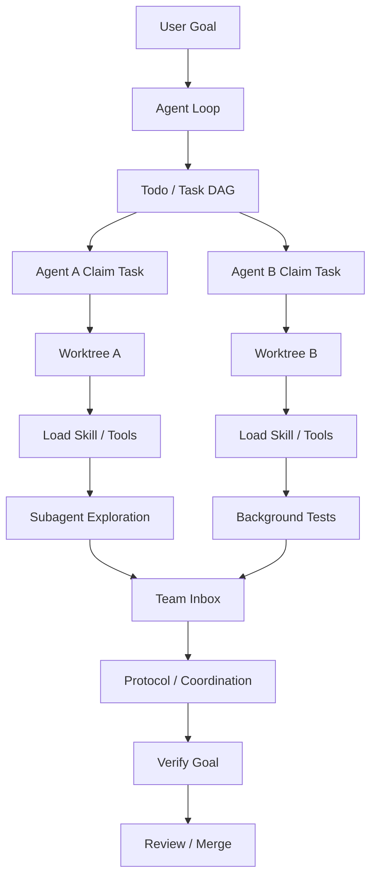

# QianAgent

<div align="center">

**从 Agent Loop 到完整 Coding Agent Runtime**

一个用 Python 从零实现的轻量 Coding Agent：不依赖 LangGraph，把模型决策、工具执行、任务调度、上下文管理、多 Agent 协作与环境隔离拆成可理解、可运行、可继续扩展的 Runtime。

[](https://www.python.org/)
[](LICENSE)
[](https://www.anthropic.com/)
[](https://platform.openai.com/)

</div>

---

## QianAgent 是什么？

很多 Coding Agent 的最小原型只有：

```text
LLM → Tool Call → Tool Result → LLM
```

真正让它能够在大型代码仓库里持续工作的，并不是再堆一个 Prompt，而是外围的 **Agent Runtime**。

QianAgent 就是在做这件事：

> **模型负责决定下一步，Runtime 负责提供安全、可恢复、可观测、可调度的执行环境。**

它从最小 `while True` Agent Loop 出发，逐步加入：

- Tool Schema / Handler / Dispatch
- Todo 与持久化 Task DAG
- Subagent 与 Agent Team
- Skill Loading 与 MCP
- Context Compact 与跨 Session Memory
- Background Tasks / Cron / Workflow
- Request / Response Team Protocol
- Autonomous Task Claim
- Permission / Hook / Trace
- Git Worktree Task Isolation
- Goal Loop、Crash / Resume 与 Provider Recovery

QianAgent 的重点不是复制某个商业 Coding Agent 的 UI，而是把 **Agent 为什么能工作** 这件事拆开，并真正落到代码里。

---

## Runtime 架构



最底层始终只有一个闭环：

```text
Messages
   ↓
  LLM
   ↓
Tool Call
   ↓
 Runtime
   ↓
Tool Result / State
   ↓
Messages
```

外围所有能力都围绕这个 Loop 扩展，而不是再建立第二套隐藏 Agent 框架。

---

## 从 Agent Loop 一步步长成 Runtime

```mermaid
flowchart LR
    A[Agent Loop] --> B[Tool Dispatch]
    B --> C[Todo State]
    C --> D[Subagent]
    D --> E[Skill Loading]
    E --> F[Context Compact]
    F --> G[Task DAG]
    G --> H[Background Tasks]
    H --> I[Agent Teams]
    I --> J[Team Protocol]
    J --> K[Autonomous Claim]
    K --> L[Worktree Isolation]
```



这条演进路线对应 QianAgent 最核心的设计问题：

| 能力 | 解决的问题 |
|---|---|
| **Agent Loop** | 模型怎么连续行动，而不是只回答一次？ |
| **Tool Dispatch** | 模型怎么把结构化意图映射到真实函数与环境？ |
| **Todo** | 长任务怎么保持当前计划，不重复、不跑偏？ |
| **Subagent** | 高噪声探索怎么不污染主 Agent 上下文？ |
| **Skill Loading** | 专业知识很多时，怎么按需加载而不是全塞进 Prompt？ |
| **Context Compact** | 上下文快满时，怎么继续工作？ |
| **Task DAG** | 多任务的依赖、阻塞和可执行状态怎么表达？ |
| **Background Tasks** | `pytest` / build / install 等慢任务怎么不阻塞主循环？ |
| **Agent Teams** | 多个长期 Agent 怎么拥有身份、状态和通信通道？ |
| **Team Protocol** | 多 Agent 怎么通过 Request / Response 可靠协调？ |
| **Autonomous Claim** | 空闲 Agent 怎么主动寻找并认领 Ready Task？ |
| **Worktree Isolation** | 多个 Agent 同时改代码时怎么避免互相污染？ |

---

## 核心能力

### 1. Agent Loop + Tool Runtime

QianAgent 直接围绕 LLM tool-loop 构建运行时：模型只产生结构化意图，真正的执行、权限与状态都由 Runtime 管理。

```text
Tool Schema
   ↓
LLM Tool Call
   ↓
Tool Router
   ↓
Handler
   ↓
Permission / Hook / Runtime State
   ↓
Environment
```

内置能力包括文件读写、编辑、Shell、Skill、MCP 以及 Runtime 级工具。

---

### 2. Todo + Task DAG

`Todo` 和 `Task` 在 QianAgent 中不是同一个概念。

```text
Todo
= 当前 Agent Session 的短期执行清单

Task DAG
= 可持久化、可依赖、可认领的系统级任务图
```

Task 可以拥有：

```text
status
owner
blocked_by
worktree
```

因此可以表达真正的任务关系：



只有依赖满足的任务才进入 Ready 状态，空闲 Agent 可以进一步自主 Claim。

---

### 3. Subagent：把探索噪声隔离出去

Subagent 不是简单的“再调用一次模型”。它拥有独立 `messages` 与独立 Agent Loop。



子 Agent 可以经历大量：

```text
读取 → 搜索 → 报错 → 重试 → 再读取 → 验证
```

父 Agent 最终只接收有价值的 Summary，而不是把所有中间噪声塞进主上下文。

---

### 4. Skill Loading：知识按需进入上下文

Tool 和 Skill 被刻意分开：

```text
Tool  = 能做什么
Skill = 应该怎么做
```

System Prompt 只暴露 Skill 的简短描述；真正需要时才加载完整 `SKILL.md`。

```text
Skill Catalog
    ↓
LLM 判断需要某项能力
    ↓
load_skill
    ↓
完整 SKILL.md / references / scripts
```

项目级 Skill 默认位于：

```text
.qian/skills/<skill-name>/SKILL.md
```

---

### 5. Context Compact + Memory

QianAgent 把 **Context** 和 **Memory** 分成两个生命周期。

**Context** 解决当前对话“装不下”：

```text
large-result persistence
→ snip
→ proactive compact
→ provider overflow reactive compact
```

**Memory** 解决未来 Session“忘了”：

```text
当前请求
→ recall durable facts
→ Agent 工作
→ Stop 前抽取长期信息
→ 下一个 Session 再召回
```

Memory 不会把 secrets、credentials、原始工具输出和临时任务状态当成长期事实保存。

---

### 6. Background Tasks：让慢任务离开主循环

```text
Agent
  ├─ 继续分析 / 编辑代码
  └─ Background Worker
        └─ pytest / build / install / long shell
```

后台任务完成后通过 notification 回到 Lead Agent，而不是让 LLM 一直等待进程结束。

这和 Subagent 的区别是：

| | Background Task | Subagent |
|---|---|---|
| 是否有 LLM | 否 | 是 |
| 是否自主决策 | 否 | 是 |
| 典型用途 | 测试、构建、安装 | 搜索、分析、局部实现 |
| 生命周期 | 进程级异步 Job | 临时智能 Worker |

---

### 7. Agent Teams + JSONL Inbox

QianAgent 可以维护长期存在的 Team Member，而不是只有一次性的 Subagent。



每个 Team Member 都拥有自己的：

```text
Identity
Agent Loop
Messages
Status
Inbox
```

消息通过 append-only JSONL mailbox 传递，并在下一次模型调用前注入对应 Agent 的上下文。

---

### 8. Team Protocol：不是“能发消息”就等于会协作

高影响操作采用 Request / Response 协议，而不是粗暴修改状态。

例如 Shutdown：



同样的握手机制可以用于计划审批等协调行为。

---

### 9. Autonomous Agents：从 Push 到 Pull

传统 Team：

```text
Lead → 指定 Bob 做 Task 3
```

QianAgent 还支持空闲 Agent 主动扫描任务看板：

```text
IDLE
 ↓
检查 Inbox
 ↓
扫描 Task DAG
 ↓
pending + unblocked + no owner
 ↓
claim_task
 ↓
WORK
```

也就是从单纯的 `Lead Push Task` 逐步变成 `Agent Pull Task`。

Context Compact 后 Runtime 还会重新注入 Agent Identity，避免长期 Agent 在压缩后丢失角色信息。

---

### 10. Git Worktree：Task 级执行隔离

Sandbox 和 Worktree 解决的是两个完全不同的问题：

```text
Sandbox
= Agent 与操作系统之间的权限边界

Worktree
= Agent 与 Agent 之间的工作环境边界
```

Task 可以绑定独立 Git Worktree：

```text
Task A → .qian/worktrees/task-a → branch A
Task B → .qian/worktrees/task-b → branch B
```

两个 Agent 即使同时修改相同路径，也在不同 working tree 中执行，最后再 Review / Merge。

---

## 不只是 Agent：还有完整 Harness

真正长期运行的 Coding Agent 还需要很多“模型自己不应该负责”的确定性机制。

QianAgent 的 `RuntimeHarness` 负责组合：

| Runtime 能力 | 作用 |
|---|---|
| **Permission** | 对 Hook 重写后的真实 Tool Input 再做权限检查 |
| **Hooks** | UserPrompt / PreToolUse / PostToolUse / Stop 生命周期扩展 |
| **Trace** | 记录运行时行为，便于审计和调试 |
| **Cron** | 跨进程持久化的计划任务 |
| **Workflow** | 带 schema、step cap、parallel cap、timeout 的可恢复工作流 |
| **Goal Loop** | Stop 前验证目标是否真的完成，避免过早结束 |
| **Resume** | 恢复 conversation、Todo、Goal 与持久 Runtime State |
| **Provider Recovery** | Context Overflow 与 transient provider error 分开处理 |

这也是 QianAgent 和“再包一层聊天 API”的主要区别。

---

## 状态不是一个万能 JSON

不同状态拥有不同生命周期：

| 状态 | 生命周期 / 存储 |
|---|---|
| Todo | 当前 Session，支持 snapshot |
| Task DAG | `.qian/tasks/`，可跨 Turn / 进程 |
| Background | 当前进程，完成后通知 |
| Cron | `.qian/scheduled_tasks.json` |
| Team Inbox | `.qian/team/inbox/` |
| Workflow Run | `.qian/runtime/*.json` |
| Goal | 当前 Session + snapshot |
| Worktree | Git + `.qian/worktrees/` |
| Memory | `~/.qian/projects/<hash>/memory/` |
| Trace | `.qian/traces/*.jsonl` |

QianAgent 刻意不把 Todo、Task、Workflow、Memory 全塞进一个“万能状态表”，因为它们的语义和生命周期并不相同。

---

## 几组最容易混淆的概念

| 概念 A | 概念 B | 区别 |
|---|---|---|
| **Tool** | **Skill** | Tool 是动作接口；Skill 是工作方法与知识 |
| **Todo** | **Task DAG** | Todo 是 Session 级计划；Task 是持久化调度图 |
| **Background** | **Subagent** | Background 不思考；Subagent 有独立 LLM Loop |
| **Subagent** | **Teammate** | Subagent 临时；Teammate 长期存在并持续通信 |
| **Context** | **Memory** | Context 管当前窗口；Memory 管跨 Session 信息 |
| **Sandbox** | **Worktree** | Sandbox 管权限；Worktree 管多 Agent 工作目录隔离 |
| **Communication** | **Protocol** | Inbox 解决能否通信；Protocol 解决如何可靠协商 |

---

## 权限模式

QianAgent 把权限判断放在真正执行之前，而不是只靠 System Prompt 约束模型。

| 模式 | 行为 |
|---|---|
| `default` | 安全读取与内部状态直接允许；高风险操作需要确认 |
| `dontAsk` | 本来需要确认的操作直接拒绝，适合 CI |
| `plan` | 只读分析，只允许写专属 Plan 文件 |
| `bypass / yolo` | 跳过确认；不代表危险操作自动变安全 |

基本原则：

> **LLM 负责提出意图，Runtime 负责验证、调度、执行和保存状态。**

---

## Quick Start

### 1. 安装

```bash
git clone https://github.com/xiaoqianran/QianAgent.git
cd QianAgent
pip install -e .
cp .env.example .env
```

需要 Python **3.11+**。

### 2. 配置模型

OpenAI-compatible：

```bash
OPENAI_API_KEY=sk-...
OPENAI_BASE_URL=https://your-gateway/v1
QIAN_MODEL=gpt-4o
```

Anthropic：

```bash
ANTHROPIC_API_KEY=sk-ant-...
QIAN_MODEL=claude-sonnet-4-6
```

### 3. 运行

```bash
python -m qian "检查这个项目并修复测试"
```

不同权限模式：

```bash
python -m qian --yolo "实现需求并运行测试"
python -m qian --plan "只分析并输出计划"
python -m qian --dont-ask "CI 环境下执行安全任务"
python -m qian --resume
```

REPL 内置命令：

```text
/clear      /turns      /cost       /context
/compact    /memory     /skills     /plan
/todo       /tasks      /background /crons
/team       /workflows  /goal       /worktrees
/trace      /<skill>    exit
```

---

## 一个完整任务如何流过 QianAgent

假设用户提出：

> 重构这个仓库的后端，补测试，并确保多个 Agent 不互相覆盖代码。

Runtime 可以形成这样的执行链：



在这个过程中：

1. Todo 管当前计划；Task DAG 管系统级依赖。
2. 空闲 Agent 自动领取 Ready Task。
3. 不同 Task 绑定不同 Worktree。
4. Skill 按需进入上下文。
5. 高噪声探索交给 Subagent。
6. 测试 / 构建交给 Background Worker。
7. Team 通过 Inbox 通信，通过 Protocol 协商。
8. Context 过长时自动 Compact。
9. Stop 前由 Goal Gate 判断任务是否真正完成。

---

## 项目结构

```text
QianAgent/
├── qian/
│   ├── agent.py          # Agent Loop / Tool Runtime
│   ├── harness.py        # Runtime 组合根
│   ├── tools.py          # Files / Shell / Tool Dispatch
│   ├── permissions.py    # 权限边界
│   ├── todo.py           # Session Todo
│   ├── tasks.py          # Persistent Task DAG
│   ├── subagent.py       # 临时子 Agent
│   ├── skills.py         # Skill Loading
│   ├── context.py        # Context Compact
│   ├── memory.py         # Cross-session Memory
│   ├── background.py     # Background Jobs
│   ├── scheduler.py      # Cron Scheduler
│   ├── teams.py          # Agent Teams / Inbox / Protocol
│   ├── workflows.py      # Workflow Runtime
│   ├── goals.py          # Goal / Stop Gate
│   ├── worktrees.py      # Git Worktree Isolation
│   ├── hooks.py          # Hooks / Trace
│   └── mcp_client.py     # MCP Client
├── .qian/
│   ├── skills/           # Project Skills
│   └── workflows/        # Project Workflows
├── docs/
│   └── runtime-architecture.md
├── examples/
├── tests/
└── pyproject.toml
```

更详细的运行时边界见：[`docs/runtime-architecture.md`](docs/runtime-architecture.md)。

---

## 设计原则

### Model decides, Runtime enforces

不要把真正的权限、状态和生命周期交给 Prompt。

```text
LLM：我想执行某个动作
↓
Runtime：检查 Hook / Permission / State / Isolation
↓
允许后才真正执行
```

### Context ≠ Memory

当前窗口装不下与未来 Session 会忘记，是两个不同问题，因此使用两套机制解决。

### Autonomy must be bounded

自动认领任务、Goal Loop、Background、Workflow 都拥有边界：预算、轮次、并发宽度、超时或生命周期限制，避免 runaway loop。

### Isolation before parallelism

只有无副作用、声明 concurrency-safe 的读取工具才允许同一 Model Turn 并行；多个 Agent 修改代码时使用 Worktree 做文件系统隔离。

### Durable only when recoverable

只有拥有可靠外部状态和重建语义的能力才被标记为可恢复。Background process 与 live Team thread 不伪装成跨进程持久状态。

---

## Self Test

```bash
python -m compileall -q qian steps tests
PYTHONPATH=. python -m unittest -v tests.test_runtime_extensions
```

运行时数据：

```text
.qian/tasks/
.qian/team/
.qian/runtime/
.qian/worktrees/
.qian/traces/
.qian/scheduled_tasks.json
```

默认不进入 Git；项目级 Skills 与 Workflows 可以作为配置提交。

---

## 为什么做 QianAgent？

Coding Agent 最值得学习的地方，不只是“怎么调用一个模型”，而是：

```text
模型如何持续行动？
工具如何安全执行？
计划如何变成显式状态？
上下文如何长期管理？
任务如何调度？
多个 Agent 如何通信和协商？
高耗时任务如何非阻塞？
多个 Worker 如何隔离工作环境？
程序崩溃之后什么可以恢复？
模型准备结束时，谁来判断目标真的完成？
```

QianAgent 希望把这些问题变成可以直接阅读、运行和修改的代码。

如果把整个项目压缩成一句话：

> **LLM 提供智能，Agent Loop 提供持续性，Tool Dispatch 把意图接到真实环境，Runtime 则负责状态、权限、上下文、调度、恢复、协作与隔离。**

---

## License

MIT License
