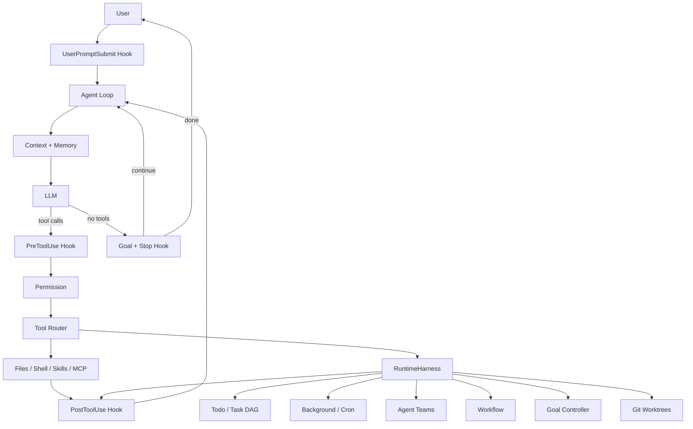

# Runtime Architecture

## 1. 为什么是 Harness，不是第二套 Agent 框架

QianAgent 的 agency 仍来自模型。`RuntimeHarness` 只负责把模型无法可靠长期维护的事情变成确定性运行时原语：状态、权限、并发、调度、恢复、隔离和观测。

## 2. 状态分层

| 层 | 生命周期 | 存储 |
|---|---|---|
| Todo | 当前 Agent session | 内存 + session snapshot |
| Task DAG | 跨 turn / 可跨进程 | `.qian/tasks/` |
| Background | 当前进程 | 内存 + 完成通知 |
| Cron | 跨进程 | `.qian/scheduled_tasks.json` |
| Team mailbox | 当前/跨线程协作 | `.qian/team/inbox/` |
| Workflow run | 可恢复 | `.qian/runtime/*.json` |
| Goal | 当前 session / active stop gate | 内存 + session snapshot |
| Worktree | 显式保留到回收 | Git + `.qian/worktrees/` |
| Memory | 跨 session | `~/.qian/projects/<hash>/memory/` |
| Trace | 当前进程/审计 | `.qian/traces/*.jsonl` |

不同生命周期不共用一个“万能状态表”，避免 Todo、durable task 和 Workflow run 语义混淆。

## 3. 并发原则

- 只有声明为 concurrency-safe 的无副作用读取工具允许同一 model turn 并行。
- Background 是进程级并发；结果通过 notification 回到 lead Agent；任务完成/取消/超时时回收原 process group。
- Team worker 是隔离子 Agent；默认不携带 Team/Cron/Workflow/Worktree 等 coordinator tools。
- Workflow `parallel` 只并行叶子 `agent/shell`；禁止在 parallel 内继续嵌套 parallel/pipeline，避免共享 journal 顺序不确定；`max_parallel/max_steps/timeout_seconds` 进一步限制执行面。
- Worktree 用 Git 文件系统隔离解决“多个 worker 同时改同一 working tree”的冲突。

## 4. 权限边界

权限检查发生在 Hook 之后、执行之前：Hook 可以重写 tool input，但重写后的 input 必须重新经过 Permission。所有 `.qian` runtime state writer 还会在 IO 前重新解析 symlink，拒绝状态路径逃出 workspace；这属于路径边界保护，不等价于 OS sandbox。

`default`：安全读取/内部状态直接放行；工作区外路径、高层自治和危险 shell 需要确认。

`dontAsk`：需要确认的动作直接拒绝，适合 CI。

`plan`：只读；只能写专属 plan 文件。

`bypass/yolo`：跳过确认，但不是“命令自动变安全”。

## 5. Context 与 Memory 的区别

Context 解决当前对话“装不下”：large-result persistence → snip → proactive compact → provider overflow reactive compact。

Memory 解决未来 session“忘了”：先按当前请求召回，再在正常 Stop 前抽取 durable facts。自动提取明确拒绝 secrets、credentials、临时任务状态、原始工具输出和当前会话摘要；Memory 文件路径也被限制在 store 根目录下。

## 6. Goal Loop

`goal_set` 不是无限循环开关。每次模型准备 Stop 时，由独立 evaluator 判断：

- `achieved`：有可验证证据，允许返回；
- `block`：未满足，注入 reminder 继续；
- `defer`：还有 background work，先把控制权交回 host；goal 保持 active，下一次收到 runtime result/用户交互时继续；
- `failed/impossible`：明确无法满足；
- `limit`：达到 `QIAN_GOAL_BLOCK_CAP`，防 runaway loop。

预算 (`max_turns/max_cost`) 仍高于 Goal：预算耗尽时不会因为 goal 未满足而无限继续。

## 7. Crash / Resume 语义

`--resume` 的 session snapshot 恢复 conversation、Todo、active Goal、turn/token/compact 统计；durable task、cron、workflow journal 和 git worktree 则从各自 workspace store 恢复。Background subprocess 与 live Team thread 属于进程生命周期，不伪装成跨进程可恢复。

Cron 使用 `pending_delivery`：到期后先把 pending 状态落盘，再调用隔离 Agent；调用失败时保留 pending，后续分钟重试，因此 one-shot 不会因为一次模型故障被静默吞掉。

这是刻意的边界：只有拥有可靠外部状态和重建语义的能力才标记 durable。

## 8. Provider Recovery

Context overflow 走 reactive compact，而 429/overloaded/timeout/5xx 属于 transient provider error。非流式主调用/子 Agent 可按 `QIAN_MODEL_RETRIES` 做有界退避；流式调用不自动重放，因为异常可能发生在已经向用户输出部分 token 之后。

## 9. Workflow Contract

Workflow 在创建 run journal **之前**验证 `input_schema`；resume 时再次验证已冻结的 args。运行时还执行 static step cap、parallel width cap 与 run timeout。这样“工作流能被模型调用”不意味着模型可以用一个 JSON 文件无限扩张执行规模。
